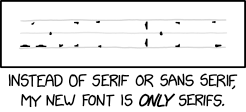

## Inspiration
This typeface is inspired by the xkcd comic "Only Serifs":

Some parts of the remaining typeface are not technically serifs, but were kept in the comic, and, thus, are kept in this typeface.

## Design

This typeface is an edit of Libre Caslon by Impallari Type. It is most suited for text setting (anything below 14pt).

## Installation
1. Download the .otf file onto your computer
2. Open the file with your font selector (MacOS: Font Book, Windows: Settings)

## License
This typeface is licensed under the SIL Open Font License